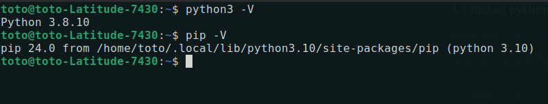
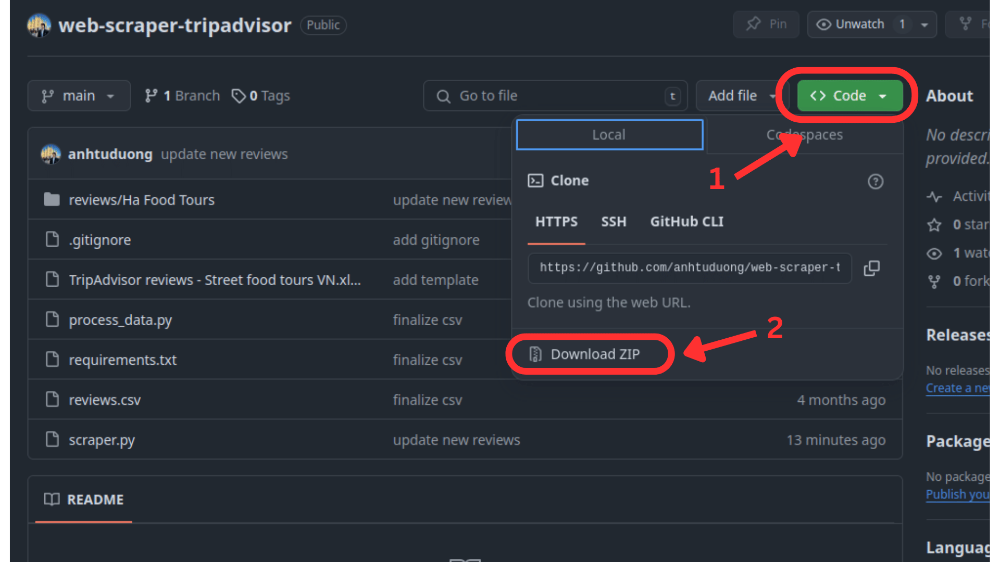
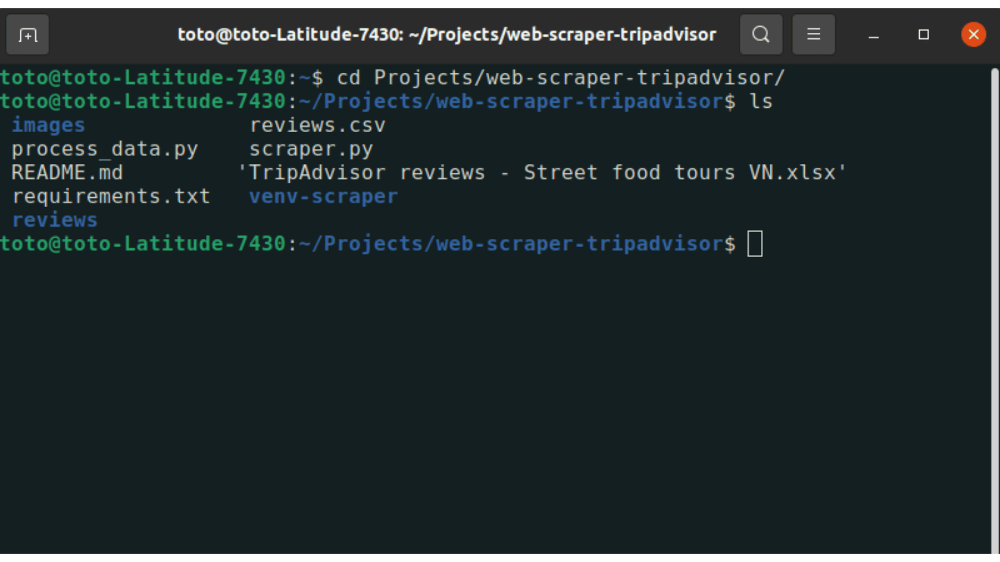
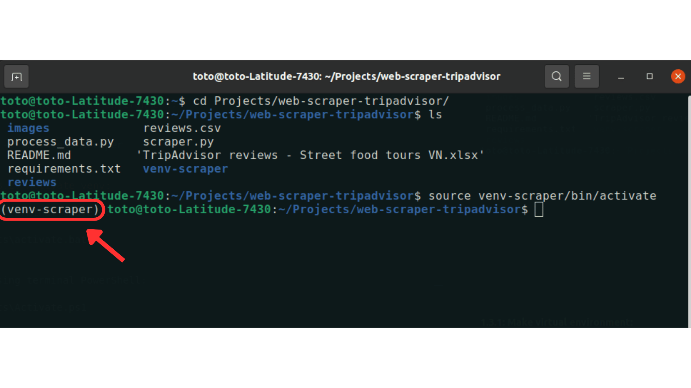
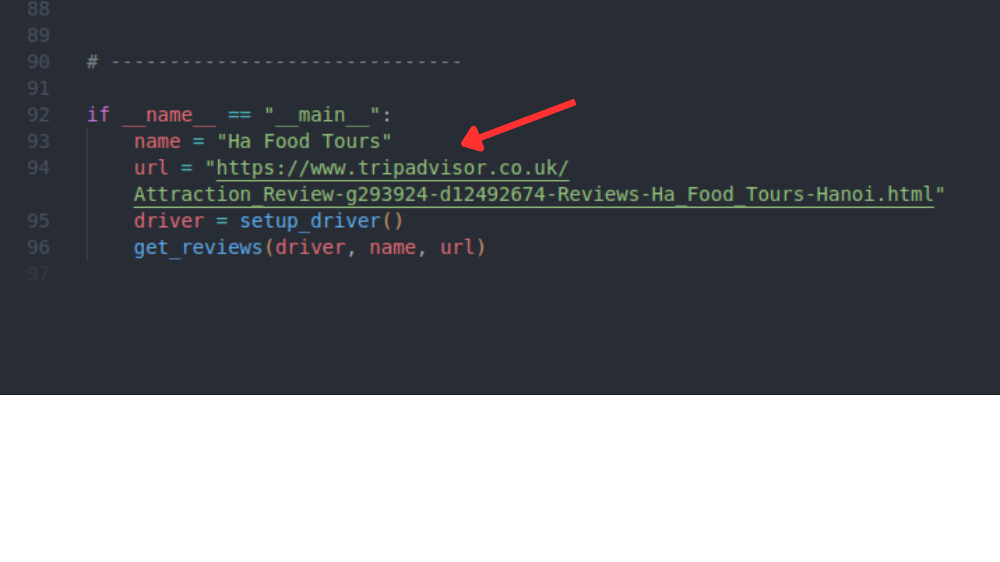
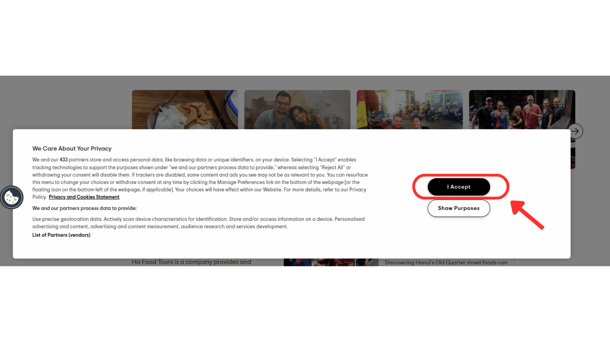
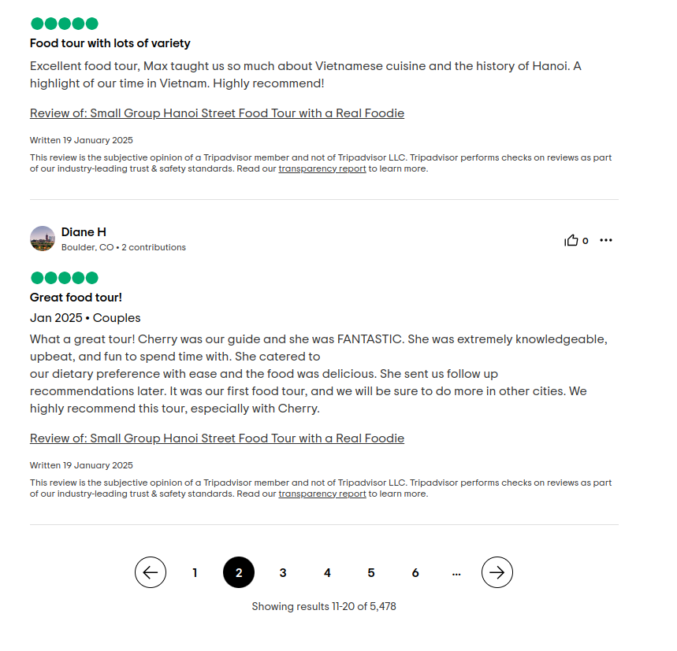

# Web scraper TripAdvisor

## 1. Install:

### 1.1 Install python 3.8.10:

Install from: https://www.python.org/downloads/release/python-3810/

Open terminal and check version:

```bash
python3 -V
```

```bash
pip -V
```



### 1.2 Install this software:

If you have git already install from your machine, use:

```bash
git clone https://github.com/anhtuduong/web-scraper-tripadvisor.git
```

Or else you can download the zip file and extract it:



### 1.3 Install libraries:

Open the terminal inside the location you downloaded the software. For example here we have it in */Projects/web-scraper-tripadvisor*



#### 1.3.1: Make virtual environment:

```bash
python3 -m venv venv-scraper
```

#### 1.3.2: Activate venv:

**Note: This should also be a starting point if you need to run the software again in the future (no need to re-download things above).**

if using terminal cmd.exe:
```bash
.\Scripts\activate.bat
```

or if using terminal PowerShell:
```bash
.\Scripts\Activate.ps1
```

Activated venv should be regconized with this:



#### 1.3.3: Install requirements:

```bash
pip install -r requirements.txt
```

(Please notify if any error appears)

---

## 2. Run the Scraper:

- 2.0 Specify which web to scrape:
    - Open the file *scraper.py* with any editor (can be opend with Text Editor).
    - In line 93: replace the name
    - In line 94: replace the web url

**Note: all the string must be in the quotation " "**



- 2.1 Run with this command:

```bash
python3 scraper.py
```

- 2.2 A Chrome window will appear, click in the Accept


- 2.3 In the terminal, press Enter to scrape the content of page 1

- 2.4 Back to the Chrome, click on page 2 in the Review


- 2.5 In the terminal, press Enter to scrape the content of page 2

- 2.6 And repeat the process 2.4 then 2.5 with page 3 and so on

- 2.7 When done scraping at the very last page, use press `Ctrl + C` to end the process in the terminal.

- 2.8 All the scraped content will be stored in `reviews/web-name`

---

### 3. Process the data

Code to run the data processing can be found in **process_data.py**. If you don't know how to process it, please compress the folder containing data, for example **reviews/Ha Food Tours/** into zip file **Ha_Food_Tours.zip** and send to email *aduong@fbk.eu*.